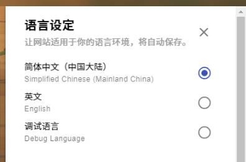
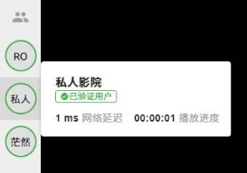
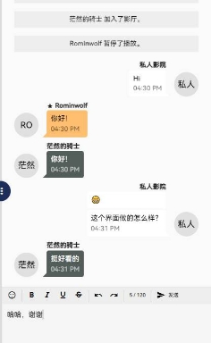
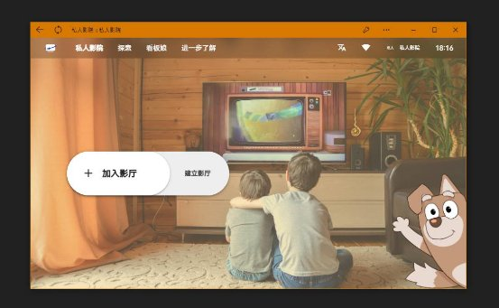
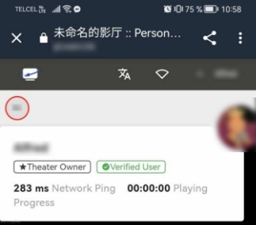

# 基于WEB的私人影院网站的设计与实现

# **摘  要**
随着全球互联网技术的飞速发展，现在几乎每家每户都至少有一台可以连接到互联网的设备。 我们的生活中越来越离不开网络，人们可以随时随地在任何时间接收到大量信息，如果可以更好地运用互联网，那么必定会为我们的生活带来更大的便利。

着眼于当下，随着网络越来越发达，足不出户就可以在家里体验到如同前往电影院观看电影般的感受，但一个人看电影终究没有坐在电影院内与其他人一起看所带来的体验更为沉浸。所以为了改善一个人看电影无聊的问题，“私人影院”项目便应运而生了。 

基于 WEB 的私人影院系统可以实现多名用户间实时观看同一则视频， 还支持进行实时通讯，比如说语音通话、文字聊天等功能，彻底与曾经一人观看电影的无聊说再见。与此同时，影厅所有人还拥有更多功能，如变更正在播放的视频，修改影厅的信息，开启或关闭影厅内的功能等等……

而对于网站的建立者，还可以前往后台的配置文件修改整个网站的功能，例如是否允许创建影厅、是否允许用户注册、是否进行敏感词检测和配置密钥等等。

**关键词** WEB；实时通讯；一起看电影；私人影院

# **Abstract**
With the rapid development of Internet technology worldwide, almost every household now has at least one device that can be connected to the Internet. The internet is becoming more and more indispensable in our lives, as people can receive a great deal of information at any time and anywhere. If we can make better use of it, then it will certainly bring greater convenience to our lives.

At the moment, with the internet becoming more and more developed, it is possible to experience a movie at home without having to go to the cinema, but watching a movie alone is not as immersive as sitting in a cinema with other people. This is why the "Personal Theater" project was created to improve the boredom of watching movies alone. 

The WEB-based personal theater system allows multiple users to watch the same video in real time, and also supports real-time communications like real-time voice calls and text chat, saying goodbye to the boredom of watching a movie alone. At the same time, the owner of the theater has more methods, such as changing the video being played, modifying the information of the theater, turning on or off the methods in the theater, etc.

The Personal Theater's owner can also go to the backend configuration file and change the entire website, such as whether to allow the creation of theaters, allow user registration, perform sensitive word detection and configure keys, etc.

**Keywords**  WEB; Real-time Communications; Watch Together; Personal Theater


# **绪论**
## **各类型影院的特征、现状与趋势**
### **线下影院的特征、现状与趋势**

所谓线下影院，通俗来讲就是“现实世界的电影院”。

自 2019 年出现的新型冠状病毒（以下简称疫情）席卷了全世界后，平均每场影厅只有 1.8 个人，全国影院的总票房直线下滑，甚至跌到了千万元以下，直接导致了国内进 60% 的电影院被迫关闭营业（附录1）。而除了疫情对电影院行业所造成的毁灭性打击外，普通民众也多多少少收到了波及。而这就是第二个重要因素：价格。

因为疫情导致众多民众无法上班（如被封小区等），但生活总还是要继续下去，那么自己可掌握的资金就会越来越少，所以像“去电影院看场电影吧”这种需求就显得不那么必要了，毕竟民以食为天，娱乐靠边站。

抛去疫情原因，第三个重要因素就是目前越来越多的在线流媒体平台放弃了院线电影，转而在自家的平台上线剧集和电影。

但即便如此，线下影院也有着一个线上影院无法比拟的优点：沉浸感。

所谓沉浸感，通俗来讲就是让人产生一种“身临其境”的感觉，仿佛置身于其中。而这种感觉是线上无法实现的，因为在影厅和在家欣赏同一部电影的感觉完全不一样，除了很多人一起看的畅快感，影院的软硬件条件也是家里无可比拟的。

光这一点，就已能保证线下影院在当代不会被取代。

### **线上影院的特征、现状与趋势**
与线下影院与之相对的就是线上影院，也就是通过桌面设备或移动设备等所有触手可得的便携式终端组成的一种通过互联网连接的，可实现至少一个人在指定房间内并共同观看同一场节目的，尽可能完美复刻线下电影院的一种全新的媒体放映方式。

**线上影院的特征**

1. 播放状态是自由的：与线下电影院不同的是，线上影院在观看节目的时候可以自行修改播放进度，你可以快进、快退或直接跳转到新的播放进度，暂停或继续播放。而线下电影院就无法做到这点，只能保持线性观看，即使是会员影厅。
1. 观看方式是自由的：与其坐在线下电影院的座位上保持不动看一场电影一到两个小时，倒不如躺在沙发上，以自己觉得最舒服的姿势看。而这就是线上影院的第二个特征：它的观看方式是绝对自由的。你可以站着看、坐着看、躺着看，在哪里都可以看，在客厅、在床上、甚至是在厕所。只要有一台能够加入影厅的设备（如手机）就可以即刻欣赏。
1. 影厅门票是免费的：线上影院观看一部电影是免费的，只要互联网上可以找到相关的资源，那么就可以直接提交到影院然后播放。而且还有效杜绝了“花冤枉钱”的威胁，比如说花了电影票的钱结果看了一部拍的一点都不好看的电影，而且没法退款，只能憋在肚子里。
1. 缓冲速度受限于网络：由于线上影院的特点，所有播放的媒体必须来自互联网，就需要时间来加载和缓冲视频，也就造成了在网络状态不好的情况下需要更多的时间来缓冲视频，而随着进入影厅的人越来越多，影厅的上游缓冲时间也会越来越久，因为需要等待所有人均缓冲完毕才能继续播放，否则就失去了同步观看这个特征。
1. 体验感不如线下电影院：由于线上影院大部分都是在家进行的，而家里的设备注定不如线下电影院，所以不管是体验感还是沉浸感都不如线下坐在电影院里亲自欣赏电影来的爽。

**线上影院的现状和趋势**

近年随着疫情的加剧，越来越多的线下电影院被迫暂停营业，而正是这种机会让线上影院从以前的不温不火到现在越来越多人关注，因为人的本性需要释放，人是社会性生物，不管是与人聊天还是娱乐，人们需要一个机会，一个可以放松的机会，一个可以和亲朋好友肆无忌惮聊天的机会。

所以在可预见的未来，随着线下电影院越来越少，线上影院注定会成为一种趋势，人们可以在家里足不出户就能体验到尽可能类似于线下电影院的感觉，至少聊天上已经可以满足这项需求了。

### **流媒体平台的特征、现状与趋势**

除了线上和线下影院，目前还有一种平台就是流媒体平台了。

所谓流媒体平台，就是采用流式传输技术，通过互联网的一个专用网站向用户提供音视频服务和计费的影音等音视频内容的平台。而一般来说，这样的流媒体平台往往都提供了一个会员服务，观看他们家的影视往往需要购买一个会员，然后就可以自由从平台上选择自己喜欢的内容在线浏览了，实现“即点即看”的能力。

目前市面上常见的流媒体平台有 Netflix、爱奇艺、Disney+ 和 Apple TV+ 等，大多数流媒体平台都有着自己的会员制度[1]。

而流式传输技术也早已不是什么近几年才出现的技术，早在 2009 年就由 Apple 公司提出一个名为 HTTP 在线串流（HTTP Live Streaming，简称 HLS）的协议，这种技术也不难理解，简单来说就是将一个视频切成很多片，然后按需加载，用户需要哪些片就提供哪些片，从而有效提升了加载媒体文件的速度和降低了所用的流量。这种技术最常用于在线播放，因为网络传输需要时间，能让用户少等一秒是一秒。

在未来，流媒体平台的温度只会愈来愈烈，随着互联网的完善，人们所持的设备越来越高端，传统的线下影院行业注定会成为小众人的“狂欢”。

## **本课题的灵感来源**

如您所见，私人影院的定义就是“一起看电影”和“一起听歌”这种较为重视多人实时的一种播放方式。所以显而易见的就是该项目的灵感来源于一起看电影和一起听歌。

其实早在去年年初，我就已经产生了制作一款类似于一起看电影的平台，因为当时确实是有这方面需求，毕竟一个人看电影实在是有些过于无聊了，朋友们离我都蛮远的，线下聚会的可能性微乎其微，所以制作这样一个平台的念头就在我脑海里蹦了出来。

于是正好就着这次毕业设计，刚好可以实现以前的那个念头（不得不说“人的欲望才是第一生产力”在我身上太适用了）。

## **本课题的主要内容**

本课题主要撰写了本项目（私人影院）的整个实现过程，包括系统的基础需求、系统的简单设计说明、系统的详细设计说明（如数据库、前端、后端、界面原型、模块功能和标识物料等内容）及如何从零开始部署本项目的详细过程，然后还讲述了本项目的定义和受众等关于本项目发展趋势等内容。

同时还撰写了本项目所用到的最重要的后端的说明，即网络数据传输和全双工通信传输的理论。

## **本章小结**

本章着重讲述了各类型影院的特征、现状和趋势及本项目的灵感和主要内容等方面的内容。从第一节到最后一节，分为三大节来诠释，分别为“1.1 各类型影院的特征、现状和趋势”、“1.2 本课题的灵感来源”和“1.3 本课题的主要内容”。

第一节“各类型影院的特征、现状和趋势”则通过“线下影院的特征、现状和趋势”、“线上影院的特征、现状和趋势”和“流媒体平台的特征、现状和趋势”三个小节分别讲述了这三种互不干涉但又互相制约的平台的关系，它们的特征、当下和未来的发展。

第二节“本课题的灵感来源”则讲解了我为什么要实现这个项目，我的动机和原因等内容。

最后第三节“本课题的主要内容”则简单阐述了本课题说了什么，提供了一个快速浏览的方法。


# **网络数据的传输与全双工通信的传输**
## **网络数据的传输**
### **网络数据传输的理论**

所谓网络数据传输，通常来讲就是超文本传输协议（Hyper Text Transfer Protocol，以下简称 HTTP）。

HTTP 是一个专门为 Web 通信设计的一种协议，即客户端-服务端模型——客户端发开一个连接发送请求，然后一直等待服务端发回的响应。同时 HTTP 是一种无状态的协议，这意味着服务端不会在这两个请求之间保留任何数据（状态），当然，现代的 HTTP 由于有了会话、数据库等临时或长时存储服务的援助，已经完全可以从无状态协议跨越到有状态协议了。

同时 HTTP 是基于 TCP/IP 层的一种协议，这意味着它不会像 UDP 那样在传递数据的过程中丢失数据（通常来说就是“丢包”），而且它还可以在任何可靠的传输层上使用，比如说 RUDP（一种基于 UDP 的可靠升级版本）。

在 HTTP 协议中，客户端和服务端各自通过传递交换数据，客户端（像浏览器）发出的数据包叫做 requests，而服务端响应的数据包则称为 responses。

在客户端层面，有一个非常重要的标记叫做“用户代理（User-Agent）”，它是一个用户发起行为的工具，通常该角色都由浏览器扮演。但还有一种情况如工程师或 Web 开发人员，他们可能需要使用专用的调试程序来模拟 User-Agent。

一个通俗易懂的 HTTP 数据传递包括：客户端（浏览器）向服务端发送数据 -> 服务端处理数据 -> 服务端返回新数据 -> 客户端（浏览器）收到新数据 -> 客户端（浏览器）更新网页。

### **网络数据传输的优缺点**

网络数据传输（以下简称 HTTP）在实际使用过程中难免会遇到好用的或不好用的一面，这里总结了一些 HTTP 的优缺点以供参考。

**HTTP 的优点**

1. HTTP 是简单的：HTTP 在设计之初的要求就是简单易读的，传递的报文可以轻易被人读懂，还允许进行简单测试，降低了使用门槛，对初学者十分友好。
1. HTTP 是可扩展的：由于 HTTP 头部的明文性，扩展这个协议变得十分简单，只要客户端和服务端可以达成头部的语义一致，那么新功能就可以轻松扩展进来。
1. HTTP 是无状态但允许会话的：HTTP 本质上是无状态的，多个执行成功的请求之间是没有关系的，用户便没有办法在同一个网站中进行连续的交互。但如果借助类似于 Cookies、Sessions 的会话存储服务，将会话存储到头部中，便可以轻松实现会话功能，这样服务端每次请求都能共享到相同的上下文信息，达成相同的状态。
1. HTTP 是可靠的：由于 HTTP 采用了 TCP 传输层协议作为传输协议，而 TCP 是可靠的（相比于 UDP），那么通常来说 HTTP 就是一种可靠的传输协议（不会丢失信息的）。
1. HTTP 是应用广泛的：不可否认的是，目前世界上绝大多数网站均采用了 HTTP 作为首要传递协议，而且由于 HTTP 不是一种语言，所以它不会因为平台和语言而受限，只要浏览器支持该协议，那么就可以使用它，跨平台性很强。

**HTTP 的缺点**

1. HTTP 是低效的：由于 HTTP 设计的缺陷，每对请求/响应都需要单独打开一个 TCP 连接，那么当需要在有限的时间内连续发起多个请求时，这种模式就显得捉襟见肘了，因为效率肯定不比多个请求发送到同一个 TCP 连接更高效。
1. HTTP 是短连接的：在早期的 HTTP 版本中（低于 1.1 的），HTTP 被设计成了短连接模式（即单工通信），但是在某些情况下如果客户端需要大量向服务端发送数据时，客户端就会每次向服务端发送一个 TCP 请求，那么相比于长连接或全双工通信，所占用的性能肯定会更高。注：随着版本的更新，目前 HTTP 2.0 已经实现了长连接和实验性的全双工通信模式。
1. HTTP 是存在性能问题的：由于 HTTP 采用了“请求 -> 应答”模式，就不得不面对“队头堵塞”这个性能问题，即当顺序发送的请求中因某个原因堵塞了，那么后面的请求也会被迫堵塞，导致整个请求队列被堵塞，而客户端迟迟收不到数据，只能干等着直到请求超时。
1. HTTP 的不安全的：在未通过 SSL 加密的情况下传递数据，数据是明文传递的，很有可能被篡改或偷取，所以在正式环境下，请一定开启 SSL 加密数据传递，保证数据的安全性。

### **网络数据传输的接口规范**

随着版本的迭代，越来越多的开发者注意到了“接口”这个东西，而架构一个好的接口不是件容易事，但随着时间的推移，接口的规范也渐渐地从无到有，变成了一个可以轻松学习的规范。

本小节主要讲述 RESTful 规范。

RESTful 中的 REST 的全称为 Representational State Transfer，即表征（表述）性状态转移[2]。需要注意的是 REST 并没有创造新的服务、组件或技术，它只是使用了 HTTP 现有的特征和能力，进一步提升 HTTP 的规范，更好地使用 HTTP 的准则和约束。

而 REST 作为一种数据传递的规范，就不得不围绕“资源”来展开讨论，这里将从资源的定义、获取和表述三个维度诠释 REST 的关键概念和简单解释。

**资源、统一资源标识符和统一资源接口**

所谓资源，指的就是世间万物，只要它有被使用的必要，那他就是一个资源。资源可以是实体（比如说这篇论文、上一顿外卖的订单），也可以是抽象的（比如说下一顿外卖吃什么）。

但光有资源还不行，因为这时的资源是无法指向的，它只是一堆不可被识别的信息，我们还需要一个标识来标记它，在 Web 中，这样的标识叫做“统一资源标识符（Uniform Resource Identifier，简称 URI）”。URI 可以作为资源的地址，也可以作为资源的名称[3]。

很重要的一点是：一个 URI 的设计应该遵循可寻址性原则，即具有自描述性，这样在第三方用户查阅该 URI 的时候才能给人一种直觉上的关联。就像位置一样，我们需要从大到小，逐步确定到一个地点，比如说“本星系群的银河系的太阳系的地球”，按照 URI 设计模式则应为“local-group/milky-way/solar-system/earth”。

而统一资源接口则包含了一系列受限的但预定义的操作，所有资源都应该使用相同的接口进行资源的访问，例如常见的 HTTP 方法如 GET、POST 和 PUT，并遵循这些方法的语义[4]。

在所有受到 HTTP 支持的方法中，可以分为安全性和幕等性两大特征。比如说 GET 和 HEAD 方法就是安全的，因为它没有改变服务器的数据，只是获取了数据。而 PUT 和 DELETE 是幕等的，即无论操作多少次，获得的结果都是一样的，再往后的请求不会再比首次产生更多的影响[5]。

**资源的表述**

资源的表述指的就是如何将资源展现出来，它的展示方式。比如说一个文本资源可以使用 HTML、JSON 等格式展示，图片可以使用 PNG、JPEG，视频可以使用 MP4、MKV 等等。

而一个资源在传递的过程中，需要在 HTTP 头部中添加“Content-Type”来确定它是什么样的资源，这样可以让客户端或服务端确定并成功解析。

## **全双工通信的传输**
### **全双工通信传输的理论**

全双工通信就是当客户端向服务端发送数据的同时服务端也可以向客户端发送数据，它们之间可以互相传输信息，各自同步进行。就像打电话一样，两名用户可以互相同时说话，而不需要一个人说话的时候另一个人只能干等，直到另一方结束说话。

与全双工通信相对的就是“单工通信”和“半双工通信”：单工通信指的就是只能一方向另一方传递数据，另一方不能返回数据，比如说遥控[6]。半双工通信指的是在一方向另一方传递数据的时候另一方暂时无法返回数据，直到数据传递完毕，另一方才能返回数据，比如说对讲机。

在本章，我将以 WebSocket 作为网络层的协议讲解，因为它支持全双工通信。

WebSocket 是基于 TCP/IP 的协议，与 HTTP 协议不同的是，它是有状态且支持长时连接的双向通信的协议[7]，同时它支持多对多（多个客户端对多个服务端）之间的实时请求与响应。

之所以叫 WebSocket，是因为它依赖于 Socket 网络通信接口实现的（一种底层通信方式）。

### **全双工通信传输的优缺点**

全双工通信（以下以 WebSocket 协议讲解）在实际使用过程中难免会遇到好用的或不好用的一面，这里总结了一些 WebSocket 的优缺点以供参考。

**优点**

1. WebSocket 是长时连接的：在客户端与服务端建立握手后就可以保持长时连接，更好地节省了服务端的性能开销，实时性也可以得到保障。
1. WebSocket 是全双工的：它支持双向通信，即客户端和服务端可以互相传输数据。
1. WebSocket 是可扩展的：在构造 WebSocket 时，可以自定义扩展它的协议，甚至是实现主要协议的子协议，比如说自定义压缩算法等。
1. WebSocket 传递的数据更少：首次建立连接后，双端进行数据交换时省区了头部的大量数据，服务端到客户端的包头只有短短几个字节，而 HTTP 每次请求都需要完整的头部。
1. WebSocket 可以实现多对多连接：由于WebSocket 基于Socket 协议作为底层，所以继承了它的优势，WebSocket 支持多对多连接，即多个客户端可以和多个服务端进行双向数据传递。

**缺点**

1. WebSocket 构建起来更为困难：相比于 HTTP 的即拿即用，WebSocket 引入了“数据帧”的方法，同时因为是全双工通信，那么在部署的时候就需要多考虑一些问题（比如说掉线了问题）。
1. WebSocket 是受网络限制的：在某些情况下，客户端可能会意外断开连接（比如说用户的网突然没了），那么需要处理好再次重连。甚至极端情况下服务端也会掉线，那么就需要服务器重新开启该服务。
1. WebSocket 是受浏览器限制的：由于 WebSocket 是 HTML5 新增的协议，而某些比较老派的浏览器并不支持该协议，那么自然而然就无法使用 WebSocket 了。

## **本章小结**

本章着重讲述了网络数据和全双工通信方面的内容。从第一节到最后一节，分为两大节来诠释，分别为“2.1 网络数据的传输”和“2.2 全双工通信的传输”。

第一节“网络数据的传输”则通过“网络数据传输的理论”、“网络数据传输的优缺点”和“网络数据传输的接口规范”三个小节从浅至深地讲述了什么是网络数据、它们的优缺点和它们的接口定义规范。

第二节“全双工通信的传输”则通过“全双工通信传输的理论”和“全双工通信传输的优缺点”两个小节讲述了全双工通信是什么和它们的优缺点。

# **基于WEB的私人影院的需求设计与实现**
## **系统基础需求**
### **系统需求分析与描述**

由于本项目的主要面向用户群体是年轻人，所以在设计界面的时候我设想的是界面一定要现代化，以及目前主流视频网站的核心功能也要有，然后年轻人感兴趣的看板娘也要加上。虽然功能很全，但我也要尽量不要让页面过于繁杂，这样就本末倒置了。

最后我决定将本项目设计成一款类似于“一起看电影”的在线网站项目，即可以多名好友共同加入一个唯一的房间，观看同一部影视，并提供即时文字聊天和语音通话的功能。不过相比于其他同类型的作品，该项目支持更多且有必要的功能。

在界面设计上，我决定采取类似于 Picarto 和 Twitch 的设计，以下几点是我看中它们的原因：

1. 私人影院是一款在线播放视频的平台，虽然它不主打直播，但仍需要着重强调“播放器”元素。也就是说进入到影厅的第一眼看到的就得是播放器，这很重要，因为用户的第一眼视觉焦点需要聚焦在播放器上，然后其他所有元素都围绕着播放器展开。
1. Twitch 在左侧边有一个可以快速访问到其他直播间的组件，而这个组件我决定可以用来显示实时用户列表。
1. Picarto 在侧边也提供了实时聊天的组件，而私人影院也提供了实时聊天的功能。
1. 这两个网站在布局设计上均采用了全版块的设计方式，即整个网页被不同的组件占满，我喜欢这样的设计方式。相反两边空荡荡的会让我产生一股切割感，体验起来很不舒服。
1. 这两个网站在整体设计上都倾向于扁平的纯色直角设计，因为拟物化并不适用于现代化网页，一个图标的元素过多反而会打乱用户的思绪。

然后我还决定为播放器增加实时弹幕的功能，因为弹幕真的很方便。

所以综合考虑，我决定设计一款：现代化的、易用的、核心内容围绕着播放的、扁平的、用组件占满整个影厅页面的、支持弹幕的、支持聊天的一款基于“一起看电影”的在线视频网站。

### **系统框架分析与描述**

整体系统我决定使用前后端分离的构建方式，即前端和后端单独实现，这样后期维护起来也更方便，接口调用也更友好，第三方开发者也更容易调用和使用开放接口服务。

在后端底层方面，我决定使用 PHP 作为底层的编程语言，因为该语言是我最为熟悉的一门语言，使用熟悉的语言可以让我用更短的时间做出更符合规范的项目。

在后端依赖管理方面，我决定使用 Composer 作为其依赖管理工具，这样能更好地维护本项目和引用其他开发者的优秀代码。

在后端框架方面，我决定使用 Flight 作为本项目的后端框架。一是它的代码轻量，在调试方面可以更容易找到错误位置；二是它实现了快速部署，仅需几行代码即可实现一个简单的接口管理器，再加上几行伪静态即可实现接口服务；三是它已经较为成熟，自首个版本发布以来，到现在已经度过了 6 年，好的项目是需要经过时间沉淀，很显然它做到了[11]。

在后端网关方面，我决定使用 WebSocket 作为网关，因为它是全双工通信的，而且因为本项目的定位需要即时通讯，所以经过综合考虑，轮询和长连接均无法较好地实现即时通讯的需求，故而选择了 WebSocket 全双工通信作为网关的网络传输协议[12]。

在数据库方面，我决定使用关系型数据库 MySQL 作为本项目的数据库。

在原型设计方面，我决定使用 Adobe Xd 作为本项目的原型图产出工具。

在前端底层方面，我决定使用最常用的老三样，即 HTML5，CSS3 和 JavaScript。

在前端框架方面，我决定使用 Vue3 和 Quasar 作为本项目的框架[13]。

### **系统框架与处理流程图**


图 3-1 前端框架图


图 3-2 后端框架图


图 3-3 数据库框架图


图 3-4系统流程图

## **系统详细设计**
### **数据库设计**

本小节记录了本项目设计的数据表、存储函数和定时事件的人类易读版本的数据库介绍。

**数据表**

**表 3-1用户表 (users)**

|#|字段名|字段类型|字段默认值|字段注释|
| :-: | :-: | :-: | :-: | :-: |
|1|id|varchar(40)|无|用户ID|
|2|is\_guest|boolean|true|是否为宾客账号|
|3|is\_verified|boolean|false|用户是否已进行邮箱验证|
|4|email|varchar(128)|无|用户邮箱|
|5|password|varchar(256)|无|用户密码|
|6|nickname|varchar(64)|无|昵称|
|7|color|varchar(8)|无|主题色|
|8|permissions|varchar(512)|{}|用户权限组|
|9|properties|varchar(2048)|{}|用户属性|
|10|created\_date|datetime|CURRENT\_TIMESTAMP|创建时间|
|11|last\_seen\_date|datetime|CURRENT\_TIMESTAMP|最后活跃时间|

用户表（如表3-1所示）：存放所有用户（包括已注册用户和宾客用户）的详细信息，确保各个用户的数据能够持久化地保存到服务器，以及可以增删改查指定用户的指定数据。

**表 3-2影厅表 (rooms)**

|#|字段名|字段类型|字段默认值|字段注释|
| :-: | :-: | :-: | :-: | :-: |
|1|id|varchar(40)|无|影厅ID|
|2|code|varchar(6)|无|影厅捷径口令|
|3|is\_public|boolean|true|是否为公开影厅|
|4|owner|varchar(40)|无|影厅所有人ID|
|5|password|varchar(2048)|无|私有影厅的访问密钥|
|6|properties|varchar(2048)|无|影厅属性|
|7|url|varchar(2048)|无|正在播放的媒体链接|
|8|progress|float|0|上游播放器的播放进度|
|9|status|varchar(16)|pause|上游播放器的播放状态|
|10|buffering|boolean|false|是否正在缓冲|
|11|created\_date|datetime|CURRENT\_TIMESTAMP|影厅创建事件|
|12|last\_seen\_date|datetime|CURRENT\_TIMESTAMP|影厅最后活跃时间|

影厅表（如表3-2所示）：存放所有影厅的详细信息，确保各个影厅的数据能够持久化地保存到服务器，以及可以增删改查指定影厅的指定数据。

**存储函数**

删除宾客用户：提供一个可以快速删除所有过期的（即首次创建时间超过 8 小时的）宾客账户的函数。

增加上游播放器播放进度：提供一个自增所有正在播放媒体的影厅的上游播放器进度的函数。

**定时事件**

自动删除宾客用户：提供一个定时器事件，时间间隔为每 1 分钟执行一次，确保所有已经过期的宾客账户都被删除，保证数据库数据冗余在可被接受的范围内。

自动自增上游播放器播放进度：提供一个定时器事件，时间间隔为每 1 秒执行一次，确实所有正在播放媒体的影厅的上游播放器播放进度保持增加。

### **开放接口设计**

本小节记录了目前可用的所有开放接口的人类易读版本的接口介绍。

**用户相关 (The Interface of Users)**

用户登录：进行用户账户的登录。参数类型为 login，需要用户邮箱和密码来登录。登录成功后获取到一个有效的用户令牌，通过该令牌可以执行完整功能，如用户的增改查，影厅的增删改查等。

用户注册：新用户申请成为影院合伙人。参数类型为 register，需要用户邮箱和密码，用户昵称和用户主题色为可选项。注册成功后获取到一个有效的用户令牌，但该用户为未验证邮箱状态，仅可执行部分免验证功能，如查询用户，修改用户等。

宾客注册：临时用户注册一个宾客账户。参数类型为 guest，用户昵称为可选项。注册成功后会获取到一个有效的用户令牌，但该宾客账户的有效期仅为 8 小时，令牌到期后该用户自动删除，且仅可执行部分功能，如加入影厅等。

获取用户信息：获取指定用户的简易数据。路径 id 为用户ID。获取成功后将返回指定用户的必要性数据，如用户ID、用户昵称、用户主题色等。

获取自身信息：获取自身的详细数据。头部需要令牌来验权。获取成功后将返回自身的完整数据，如用户邮箱、用户权限等。

修改自身信息：修改自身的指定数据。头部需要令牌来验权，需要允许修改的键和值。修改成功后返回 200 成功响应。

**影厅相关 (The Interface of Theaters)**

建立影厅：建立一个新的影厅。头部需要令牌来验权，是否为公开影厅、访问密钥、影厅标题、影厅主题色、捷径口令和扩展插件为可选项。建立完毕后会获取到该影厅的ID。

获取影厅信息：获取指定影厅的详细数据。头部需要令牌来验权，路径 id 为影厅ID，且该令牌的用户在影厅内。获取成功后返回目标影厅的完整数据，如影厅密钥、正在播放的视频链接、即时用户列表等。

更新影厅信息：更新自身的指定影厅的所有数据。头部需要令牌来验权，路径 id 为影厅ID，且该令牌的用户为该影厅的所有者。需要是否为公开影厅、访问密钥、影厅标题、影厅主题色、捷径口令、扩展插件和播放的视频链接。修改成功后会返回 200 成功响应。

删除指定影厅：删除自身的指定影厅。头部需要令牌来验权，路径 id 为影厅ID，且该令牌的用户为该影厅的所有者。删除成功后该影厅的所有数据将完全删除，所有人都将无法访问。删除成功后返回 200 成功响应。

发现影厅：获取所有公开影厅的简易数据。获取成功后将以列表的形式返回影厅的必要性数据，如捷径口令、影厅标题和当前影厅内用户数量等。

获取自身的所有影厅：获取自身的所有影厅的详细数据。头部需要令牌来验权。获取成功后将以列表的形式返回影厅的完整数据，如影厅密钥、影厅正在播放的视频链接、影厅内实时用户列表等。

用户加入到影厅：用户加入到指定影厅。头部需要令牌来验权，需要影厅ID或捷径口令的任意一个（互斥），如果影厅为私有影厅则需要影厅密钥。加入成功后获取该影厅的详细数据及频道数据，如影厅开播时间、频道令牌和语音通话令牌等。

**验证相关 (The Interface of Verifications)**

发送用户验证邮件：发送一封用户邮箱验证邮件到用户邮箱。头部需要令牌来验权，且仅未验证用户才能发送邮件。发送完毕后返回 200 成功响应。

验证用户邮箱：进行用户的邮箱所有权验证。路径 token 为有效的验证令牌。验证成功后该用户的用户组将变更为已验证用户，拥有完整用户权限。

**Live2D 相关 (The Interface of Live2D)**

更新模型和材质：重新加载服务器中保存的模型和材质数据到缓存。

获取模型信息：从缓存中获取一个模型的详细信息，通过信息获取模型和材质数据。

获取加载数据：通过模型和材质信息提供的虚拟路径来向服务器获取文件的物理数据。

随机获取模型信息：随机从所有模型列表中获取一个模型的必要性信息。

切换到下一个模型信息：通过指定模型编号获取该模型的下一个模型的必要性信息。

随机获取模型的材质信息：随机获取指定模型的所有材质列表中获取一个材质的必要性信息。

切换到模型的下一个材质信息：通过指定模型编号的指定材质编号获取该模型的材质的下一个材质的必要性信息[14]。

### **实时数据通信设计**

本小节记录了目前可用的所有实时数据通信的人类易读版本的信令和事件介绍。

**信令 (Signals)**

HELLO：客户端首次连接到服务端后服务端返回给客户端的响应信令。客户端应尽快接受到服务端的响应，否则认为服务端已不在线上，应立刻重新尝试连接。

PING：客户端每隔一段时间向服务端发送心跳包的信令。服务端通过该心跳包确定客户端仍在线上而不是已经断开连接。客户端发送的心跳包应包含当时的毫秒级时间戳。

PONG：服务端收到客户端发送的心跳包后立即返回一个心跳包的信令。客户端通过该心跳包确定服务端仍在线上而不是已经断开连接。服务端发送的心跳包应包含双向的毫秒级时间戳和延迟毫秒数。

MSG：客户端向服务端或服务端向客户端发送消息的信令。客户端向服务端发送消息后应根据提供的数据立即返回给相关的影厅或用户以确保实现双向聊天功能。

EVENT：客户端向服务端或服务端向客户端发送事件的信令。客户端向服务端发送的事件应交给服务端处理并尽快返回给各类型的客户端。服务端向客户端发送的事件应由客户端尽快执行设定的要求[8]。

**客户端到服务端事件 (Events from Client to Server)**

令牌验证：用户加入影厅频道前需要通过频道令牌验证是否有权限加入的事件。服务端接受到此事件后应立即验证提供的频道令牌是否有效，验证成功后才算正式加入到了目标影厅，允许接收目标影厅的数据和发送数据到目标影厅。

离开影厅：用户手动离开影厅（及其频道）时会发送给服务端的事件。服务端接受到此事件后应立即向该影厅内的其他用户发送“用户离开影厅”事件。

播放进度：用户提交即时视频播放进度给服务端的事件。服务端接受到用户的播放进度后更新用户播放进度缓存数据。如果用户以变更上游播放器进度为由提交进度则向所有影厅内的所有发送“播放进度更新”事件。

播放状态：用户变更当前的播放状态给服务端的事件。服务端接受到用户新的播放状态后应立即向影厅内的所有用户发送“播放状态更新”事件。

播放链接：影厅所有者变更需要进行播放的视频播放链接给服务端的事件。服务端接受到新的播放链接后应立即向影厅内的所有用户发送“播放链接更新”事件。

声网令牌：用户尝试更新自己的语音通话令牌的事件。服务端收到该事件后应立即向该用户发送“声网令牌更新”事件。

**服务端到客户端事件 (Events from Server to Client)**

用户加入到影厅：服务端向影厅内的所有客户端发送有新的用户加入到影厅的事件。客户端收到该事件后应立即在允许通知的区域内发表新的通知（如聊天室）并更新影厅内的即时用户列表。

用户离开影厅：服务端向影厅内的所有客户端发送有用户离开了影厅的事件。客户端收到该事件后应立即在允许通知的区域内发表新的通知（如聊天室）并更新影厅内的即时用户列表。

影厅信息更新：服务端向影厅内的所有客户端发送该影厅的信息发生变更的事件。客户端收到该事件后应立即更新影厅的信息，如果是动态数据则需要强制重置（如视频链接变更）。

用户信息更新：服务端向影厅内的所有客户端发送该用户的信息发生变更的事件。客户端收到该事件后应立即更新目标用户的信息。

播放进度更新：服务端向影厅内的所有客户端发送当前视频播放进度发生变更的事件。客户端收到该事件后根据服务端提供的播放进度和本地播放进度进行差值比对，如果相差较大则应立即强制修改播放器的播放进度来同步播放进度。

播放状态更新：服务端向影厅内的所有客户端发送播放器的播放状态发送变更的事件。客户端收到该事件后应立即更新本地播放器的播放状态（如播放、暂停、缓冲中）。

播放链接更新：服务端向影厅内的所有客户端发送欲播放的链接发生变更的事件。客户端收到该事件后应立即更新本地播放器正在播放或准备播放的播放链接。

用户延迟变更：服务端向影厅内的所有客户端发送指定用户的即时延迟发生变动的事件。客户端收到该事件后应立即更新目标用户的延迟信息。

声网令牌更新：服务端向发送变更声网令牌请求的客户端的回应的事件。客户端收到该事件后应立即更新本地语音通话的声网令牌，确保可以不间断更新。

**内部调用 (Innies)**

获取指定影厅内的在线用户列表：根据影厅ID获取指定影厅的实时用户列表。

### **网站的原型与界面设计**

本小节记录并对比了私人影院的原型设计图和实际构建出的界面图。由于种种原因，实际构建出的界面图难免会砍掉部分原型图中的设计元素。


图 3-5首页的对比

这是首页的原型图和实际图的对比（如图3-5所示）。相比于原型图，实际图：

1. 删除了页面右侧的首屏导语和底部的快速访问组件。
1. 左下角的看板娘组件移动到了右下角。
1. 建立影厅按钮的“+”号图标变得更小来看得更舒服。


图 3-6影厅页的对比

这是影厅页的原型图和实际图对比（如图3-6所示）。相比于原型图，实际图：

1. 左侧实时用户列表的间距变得更大。
1. 顶部综合导航栏除了“已开播时间”，还增加了“即时本地播放器播放进度”。
1. 播放器底栏移除了“影院模式”图标按钮。
1. 增加了布局分割器模块，可以自由拖动显示的布局。
1. 右侧评论区底部的发表评论板块重新绘制了样式。


图 3-7探索页的对比

这是探索页的原型图和实际图的对比（如图3-7所示）。相比于原型图，实际图：

1. 页面名称从“发现”变更为了“探索”。
1. 左侧的菜单侧栏移动到了右侧。
1. 移除了顶部的“搜索世间万物”模块。
1. 右侧的菜单侧栏标题后新增了“刷新”图标按钮。


图 3-8邮件样式

这是发送给用户的一封邮件的样式（如图3-8所示），邮件内元素包括了本项目的标识图、标题、正文、一个焦点按钮及项目运行年份。

### **网站的功能模块设计**

本小节将详细展示本项目的各个功能的模块及其介绍。



图 3-9语言设定

**国际化 (Internationalization)**

国际化即多语言化，简称 i18n。目的是为了提供给不同语言、不同地区和不同文化的用户的本地化需求。本项目也采用了国际化模式，点击菜单栏右上角的“文A”图标即可切换网站所显示的默认语言（如图3-9所示），目前支持简体中文、英文和调试语言。


图 3-10看板娘

**看板娘 (Yuru-chara)**

看板娘即拟人化的吉祥物，也叫做虚拟代言人，起源于日本里指一家店铺里代表店铺形象的女店员。通常来讲就是一个产品（品牌）的对外形象，一个好的形象可以让用户更容易对该产品（品牌）产生更浓厚的兴趣及记住这个产品（品牌）。本项目也设计了一个看板娘（如图3-10所示），是一只半折耳的黄棕色小狗人，他的详细角色设计请详见小节 3.3.6 标识物料设计。


图 3-11实时延迟

**实时延迟 (Myself Realtime Ping)**

实时延迟用于记录并展示用户所用的客户端到服务端的单次往返所需的时间，延迟越小说明网络状态越好，网络状态越好就可以越快与其他用户进行数据同步和不易掉线。如需获取实时的延迟信息可点击菜单栏右上角的“WIFI”图标，内容板块分为一个总览和四个维度（如图3-11所示）。总览展示了当前延迟的可视化得分，得分越低网络状态越差。四个维度分别为即时通讯、语音聊天、时延和下行：即时通讯即本地客户端到即时通讯服务端的毫秒级延迟；语音聊天为本地客户端到语音聊天服务端的延迟状态（只有加入语音频道才会获取该值）；时延为本地客户端向远端客户端发送并接收到数据所需的时间；下行即当前设备的下载速度。


图 3-12自身档案

**自身档案 (Myself Achieve)**

自身档案分为三个板块，分别为个人资料板块、影厅资料板块和宾客资料板块（如图3-12所示）。

个人资料板块：加载了该用户的详细资料，包括但不限于用户昵称、电子邮箱、编号和申请时间等等。同时可以在该板块修改或重置自身的指定数据如用户昵称、登录密码等等。未进行邮箱验证的用户可以在这里发送验证邮件到自己的邮箱进行验证，也可以在这里登出账号。

影厅资料板块：加载了该用户所创建的影厅的必要性信息列表，例如影厅标题、编号、影厅捷径口令和建立时间等等。每个影厅都附加一个“修改影厅信息”按钮，点击该按钮可快速跳转到目标影厅然后修改其详细信息。

宾客资料板块：加载了未登录状态的用户（即宾客用户）可使用该临时账号的剩余时间。提供了“登录”和“注册”两个按钮来快速进行用户的登录或注册。



图 3-13实时用户列表

**实时用户列表 (Realtime User List)**

影厅内实时用户列表即影厅页左侧的一列（移动设备在顶部显示一行）显示用户实时状态的板块，实时用户列表将同步显示当下影厅内的用户状态（如图3-13所示）。

用户外部框架包括用户头像、用户可视化延迟框和用户语音聊天标记徽章（仅加入到语音聊天才显示）。

当用户给予一个用户外部框架焦点时（hover state）会显示该用户的详细状态，包括该用户的用户昵称、用户是否为影厅所有者、用户是否已经验证邮箱、用户是否为宾客账户、用户的实时网络延迟和用户的当前播放进度等信息。

该组件将允许所有用户即时查阅到该影厅内的其他用户的即时通讯数据和状态，确保每名用户的同步率均保持在合法的误差范围内。



图 3-14聊天室

**聊天室 (Chatting Room)**

影厅内聊天室位于影厅页的最右侧（移动设备需要手动拖拽出聊天室），它用来接收影厅的实时事件并提供了用户聊天的功能（相当于多人群聊）（如图3-14所示）。

当收到一个事件后会进行解析并转换为人类可读的形式后新建一则事件气泡以显示在聊天室。

当发送或收到一则聊天气泡后会显示在聊天室，一则聊天气泡包括目标用户的昵称、头像、用户主题色、是否为影厅所有者、消息内容和发送时间等信息。

当用户向上滚动聊天记录时会自动退出“黏性消息流”模式（即接受到新消息时不会自动滚动到最下方），直到用户点击“恢复黏性消息流”按钮或手动滚动到最下方。

在聊天室的最下方提供了一套所见即所得（what you see is what you get）的编辑模块来发送一条消息。上方功能组提供了“加载表情符号模块”按钮，加粗、倾斜、下划线和删除线四种文字样式，撤销和重做两种消息处理方式，实时消息字符和上限提示和“发送消息”按钮。

当用户点击“加载表情符号模块”按钮时会在聊天记录上方显示表情符号模块，用户可以在这里自行选择想要的表情符号附加到输入框中。当该模块失去焦点后自动消失。

同时由于即时聊天的特殊情景性质，本项目还内置了“文本内容安全”功能，在后端配置好所需要的信息后即可选择是否开启此功能。开启后每条用户发送到服务端的消息都会进行一次内容审查，如果存在不被允许的内容（如敏感、垃圾、广告、违禁消息等）则屏蔽该消息，其他用户不会收到，仅自己可见。


图 3-15播放器

**播放器 (Player)**

影厅内播放器使用 ArtPlayer 组件作为播放器的基本框架[15]，并进行了深度优化来适配本项目的需求，同时增加了播放器弹幕功能、显示上游播放器播放进度的高亮标记、移除了部分不适用于本项目的组件和支持更多媒体文件的格式（如图3-15所示）。

播放器弹幕功能：弹幕是一种增强媒体浏览体验的机制，通过该机制，可以在特定时间点以一种特定的方式渲染并动画化大量的评论到播放器上显示出来。本项目的播放器允许用户自行设定部分选项，但大部分设定仅可使用已经设定好的选项，例如弹幕展示方向、Web Wocker和弹幕过滤器。

显示上游播放器播放进度的高亮标记：由于本项目使用的播放进度规则为上游播放器播放进度，为了能第一时间查询上游播放器播放到哪里了，则在进度条上附加了一个用于显示即时上游播放器播放进度的高亮标记。

移除了部分不适用于本项目的组件：删除了所有原生的播放器控制组件（如播放按钮、暂停按钮、音量控制按钮、设置按钮等），同时将原生播放进度条的位置移至播放器底部来获得更友好的体验。

支持更多媒体文件格式：除了基础的 MP4 视频文件格式，还支持 M3U8 和 FLV 视频格式来增强用户体验。


图 3-16播放模式

**播放模式 (Play Mode)**

本项目允许以两种不同的模式显示播放器的状态，分别为画中画模式和剧院模式（如图3-16所示）。

画中画模式：画中画模式是一种特殊的播放模式，它允许将播放器以置顶的方式固定到屏幕一角并转变成一个小窗口继续观看视频，同时可以切换到其他应用进行多任务操作，互不干扰，一心多用。

剧院模式：剧院模式是本项目的一种特殊的播放模式，它允许关闭影厅页中多余的组件元素，只留下必要的组件，让用户可以沉浸式地欣赏视频。本模式的特点包括：更大的播放器控件、关闭影厅顶部综合服务模块、关闭影厅底部信息模块、关闭右侧聊天模块、功能更全的播放器底部控制模块。

**上游播放器 (Upstream Player)**

因为本项目使用以上游播放器为基准的播放规则，所以所有本地客户端的播放器均需要向上游服务端的播放器获取即时的播放信息，从而决定本地播放器的播放信息。

上游播放器目前拥有四个方向的数据处理流，分别为：播放状态、播放进度、播放链接和播放缓冲状态，每个方向处理的内容不同，发送和接收的事件也不相同。

播放状态：即上游播放器的实时播放状态，存在“正在播放”和“已暂停”两个状态。其中“正在播放”状态为影厅内所有用户均未在暂停状态且未在缓冲状态时触发，“已暂停”状态为影厅内有至少一名用户暂停了播放则全局内所有用户均进入暂停状态时触发。

播放进度：即上游播放器的实时播放进度。影厅内的所有用户的本地播放器均以上游播放器的播放进度作为基准，即上游播放器播放到哪里，本地播放器就播放到哪里，向上误差不超过 5 秒，向下误差不超过 30 秒。当本地播放器的误差超过了最大值则强制跳转回误差内。

播放链接：即影厅内所有用户需同步播放的一个媒体直链，确保所有用户均在播放同一个媒体文件。

播放缓冲状态：即影厅内至少有一名用户的本地播放器进入了缓冲状态则上游播放器进入该状态，缓冲状态下的上游播放器不会继续播放，直到所有用户均缓冲完毕。



图 3-17渐进式网络应用程序

**渐进式网络应用程序 (Progressive Web App)**

渐进式网络应用程序（以下简称 PWA）是一种全新的应用程序标准，这项功能允许网站生成一个类似于原生平台应用程序的应用，但使用 PWA 可以更容易访问且使用起来更为方便和迅速。

与此同时，由 PWA 生成的应用程序可以更加完美的整合进操作系统，进一步为用户提供无缝的操作体验，它还可以在离线的状态下运行，同时用户无需手动进入浏览器访问网站，直接通过主页上的 PWA 应用图标访问会更加方便和友好（如图3-17所示）。

相比于原生网站，PWA 拥有以下更多优势：

1. 安装 PWA 后可以有效降低网站的加载时间。因为它使用了一种名为 Service Workers 的中间人服务帮助进行数据缓存，以此来节省所需带宽和访问时间。
1. 当应用存在更新时，只会重新加载发生变动的那些内容。相比于原生网站，即时只更改了一行代码也需要强制用户重新下载网站内所需要的所有数据。
1. 使用 PWA 生成的应用程序的外观上看起来和原生平台的应用程序别无二致。在主屏幕上放置一个应用图标，一键部署，点击访问，高效便捷。而且它还可以全屏运行。
1. 凭借系统通知和推送信息与用户保持实时连接，让用户不错过任何一则消息，提升用户黏性。
1. 兼容性良好。所有主流浏览器均支持 PWA 最重要的 Service Worker 服务，那么也就可以创建 PWA。


图 3-18语音聊天

**语音聊天 (Voice Chatting)**

除了基础的文字实时聊天，本项目还支持语音实时通话功能，在后端配置好所需要的信息后会自动开启此功能。

用户加入影厅后可点击上方影厅综合导航条右侧的“电话”样的图标按钮操作语音频道相关的模块，目前支持“加入或离开语音频道”和“是否静音自身麦克风”两个模块功能（如图3-18所示）。

加入或离开语音频道：当用户点击此按钮后会自动判断当前是否已经加入语音频道，如果没有加入则加入，反之退出。在用户加入语音频道时会向语音服务器发送加入认证请求，直到服务端响应加入或离开语音频道的状态，并向在语音频道内的所有用户推送加入或离开频道事件。

是否静音自身麦克风：用户加入到语音频道后可以选择是否静音自身的麦克风的输出流（即闭麦），关闭后其他用户将无法收到你发出的声音，直到重新开启麦克风的输出流。


图 3-19聊天设定

**聊天设定 (Chat Setting)**

如需显示聊天设定模块，则需要点击影厅内上方影厅综合导航条右侧的“齿轮”样的图标按钮后点击“聊天设定”按钮，点击后该模块将以侧边栏抽屉的样式显示在影厅右侧，你可以在此更改聊天室的相关设定，并会自动保存（如图3-19所示）。

目前该模块允许变更以下两个设定：“开启或关闭音效”和“显示或隐藏时间”。

开启或关闭音效：开启此功能后，每当客户端收到一条消息或事件都会同时播放一条简短的音效来提醒用户。消息和事件的音效不同。默认状态为关闭。

显示或隐藏时间：开启此功能后，每当客户端收到一条消息后都会同时在气泡最后显示发送该条消息的 UTC+8 时间（即 PRC 时间）。时间格式为“小时:分钟 [上午/下午]”。默认状态为开启。


图 3-20影厅设定

**影厅设定 (Theater Setting)**

影厅设定模块仅影厅所有者可见，如需显示该模块，需要点击影厅内上方影厅综合导航条右侧的“齿轮”样的图标按钮后点击“影厅设定”按钮，点击后该模块将以侧边栏抽屉的样式显示在影厅右侧，影厅所有者可以在此改变影厅的大部分信息，修改完毕后点击下方“提交”按钮后将推送新的影厅信息到影厅内的所有用户（如图3-20所示）。

目前该模块允许变更以下六个设定：“影厅标题”、“影厅捷径口令”、“主题色”、“是否为公开影厅”、“是否允许文字聊天”和“是否允许语音通话”。

是否为公开影厅：关闭后任何加入到该影厅的用户均需要输入预先设定好的密钥才能访问。

是否允许文字聊天：关闭后影厅内将无法发送消息，但事件仍然可以正常接收。

是否允许语音通话：关闭后影厅内将无法加入到语音通话频道，原先已加入到语音频道的所有用户将被迫离开。

**布局分割器 (Layout Splitter)**

布局分割器是一种可以高度自定化页面内各个布局尺寸的一种组件。使用该组件，用户可以手动调节页面内允许操作的元素的宽度和高度，仅需将鼠标移至分割条上，按住并拖动鼠标即可修改布局尺寸。

布局分割器十分有用，某些情况下，我们在影厅内可能完全不聊天，一心只想欣赏影片带来的沉浸式体验，那么我们就可以将影厅主体分割器拖动到最右边来实现“不看聊天和事件”的能力。当然，有些时候观看视频是次要的，我们会更重视聊天带来的愉悦感，那么我们可以将影厅主题分割器适当拖动到左边来实现“小屏播放视频，主要还是聊天”的能力。

总的来说，布局分割器给予了用户一个可以自由调整页面内元素尺寸的能力，让用户可以更好地自行决定元素的宽度和高度。

**JSON 网络令牌 (Json Web Token)**

JSON 网络令牌（简称 JWT）是一种紧凑且自包含的，以 JSON 为编码格式的，安全且可被验证并信任的一种携带 Token 并进行数字签名的标准[9]。

所谓签名，简单来说就是只有信息的发送者才能生成而其他人无法伪造的一段数据，更重要的是这段数据可以证明这段信息来自发送者而不是其他人[10]，提供了一串有效的信息真实性的证明。而签名的算法也不尽相同，有类似于 DES 的对称加密算法，也有类似有 RSA 的非对称加密算法，通常来说，所需安全性越高的场景越需要更高比特的非对称加密算法。

而由 JWT 生成的 Token 则包括了“头部”、“负载”和“签名”三段内容，每段内容使用半角点号分割。

一个典型的头部有两部分组成，分别为“所用的算法”和“生成的类型”。所用的算法即生成这段 Token 时所采用了什么算法，如 HS256 还是 RSA。生成的类型即 JWT。

而负载是一段 Token 中最为重要的地方，这里包括了官方规定的字段和自行添加的字段。官方规定的字段包括“签发人”、“过期时间”、“主题”、“受众”、“生效时间”、“签发时间”和“令牌编号”七个字段，每个字段的含义即内容均不相同。而自行添加的字段则为向一个 Token 中添加进入的附加字段，如“用户编号”等。但请注意，由于 JWT 规范负载是不加密的，所以请不要往里面添加敏感内容。

最后是签名部分，通过签名算法将经过 Base64 URL 安全编码的头部和负载通过只有服务端直到的密钥进行签名，得到的内容就是已经成功签名的内容了。

JWT 相比于 Session 或 Cookie 验证，它拥有以下优点：

1. JWT 是无状态的。不同于 Cookie，Token 可以随时随地直接放置到 HTTP 头部进行传输，因为 HTTP 协议就是无状态的。
1. JWT 是解耦的。不同于 Session，Token 可以包括所有需要用于登录的信息，而且可以在任何地方保存它，例如客户端的 Cookies，Local Storage，本机文件，甚至是将它手写到备忘录中。
1. JWT 更容易被广泛支持。只要客户端支持网络传递数据，那么就可以使用 Token 验证。
1. 服务端只需要验证 Token。不同于 Session，由于所需要的信息已经保存在 Token 里，服务端只需要验证拿到的 Token 是否有效未被篡改即可，不需要再使用 Session 登录用户账号来获取信息了。
1. JWT 是基于标准化的。JWT 标准已经被 .NET、Java、PyThon 和 PHP 等多种编程语言所支持，而大型企业如 Google、Microsoft、Tencent 也已经开始使用该标准。

### **标识物料设计**

标识是每个站点、每个产品甚至是每个品牌重要的元素构成之一，一个好的标识可以让客户更容易对产品产生更浓厚的兴趣、产生更多的用户粘性并更容易记住这个产品。

例如知名视频网站“哔哩哔哩”的原创标识，它们的站点图标是一个小型电视机的样子，而它们的看板娘则为两位可爱的女孩子，分别名为“22”和“33”。

本项目也设计了一组原创标识，包括站点图标和看板娘。


图 3-21站点图标

**站点图标**

本项目的站点图标为一个深蓝紫色的圆环围绕着一台白色的桌面设备，而在设备面前，圆环的头部附加了三个颜色渐渐变浅的蓝紫色圆（如图3-21所示）。

之所以使用蓝紫色（#3F51B5）作为圆环的颜色，是因为本项目的主题色就是该色，而圆环在构成上还有“将我们连接到一起”的寓意，且本项目的定义就是需要我们一起欣赏，所以使用深蓝紫色作为圆环的含义就不言而喻了，即——我们一起看。

而被圆环围绕的桌面设备则表示了“怎么看”，在大部分情况下，我们都是坐在电脑前，戴着耳机，通过互联网和远在世界各地的朋友们共同欣赏一部电影，一起聊天，一起产生情感。所以桌面设备是第二个标识的主要构成，即——我们一起看的方式。

最后在桌面设备前面，在圆环的头部有三个颜色渐渐变浅的蓝紫色圆，它们的含义则是“我们自己”，我不是一个人，朋友们和我一起在看。


图 3-22看板娘

**看板娘**

本项目的首个看板娘名为“拉普汉德·皮埃拉特”，是一名来自塔萨兰岛的男性小狗人，身高为 171 厘米，性格则十分开朗友善和活泼（如图3-22所示）。

他还有一位和他从事一样工作的名叫特桑农的哥哥，他们的工作都跟影视制作有关，皮埃拉特则主要偏向于后期包装，同时他们共同创立了一家名为“台前幕后”的影视工作团队。

他的爱好有剪辑视频、看电影、品鉴美食（特别喜欢吃辣的）、制作美食（大部分都是辣的），他还是一名摄影爱好者，通常来说，他会使用一台或多台专业的滑轨车摄影机来辅助作业。

现实世界的物种参考了芬兰拉普猎犬。

他的身体特征有：毛发：浅棕色和亮棕色；眉毛：亮棕色；鼻子：亮棕色；内耳：亮棕色；耳朵：左耳直立，右耳笼拉下来；颊、喉咙和下颚表面处的毛发：亮棕色；胸：亮棕色；前臂、腕部和前系：亮棕色；腹部：亮棕色；飞节、掌部和脚趾：亮棕色。

最后值得一提的是：

1. 拉普汉德这个姓表示的就是他们的种族“拉普猎犬”（Lapphund）的音译。
1. 皮埃拉特这个名字由本项目的英文名“Personal Theater”变体而来，即：Per'ater。
1. 他喜欢看电影的爱好来自本项目的定位，即私人影院，主要还是看电影。
1. 他热爱品鉴美食和制作美食的爱好来源于他的英文名“Pierat”在英语俚语中有一层“创造性地寻找食物”的含义。

## **部署私人影院系统**
### **部署的前置条件**

请确保在部署前拥有一定的运维知识，这样可以更好地理解操作流程，不绕弯路。

在正式部署前请确保使用服务器作为机器，同时服务器安装了宝塔面板（正式环境）。

然后通过宝塔面板安装以下服务：

1. Nginx 1.20+
1. PHP 8+
1. MySQL 8+

当然，如果你十分熟悉运维知识，可以不使用宝塔面板部署，自行构建所需要的站点文件。

另外，如果你使用的机器为个人电脑，使用小皮面板也可以部署在本机（测试环境）。

本机方面，由于前端服务需要手动构建可执行文件，所以请确保本机已安装以下应用：

1. Node.js 16+

### **部署数据库服务**

由于本项目用到了事件功能，所以请使用 MySQL 部署数据库。分为以下几步：

1. （可选）如果你有权限创建新的库，那么为了安全起见请创建一个“私人影院”库。推荐库名：personal\_theater。
1. （可选）如果你有权限创建数据库账户，那么为了安全起见请创建一个专门用于管理“私人影院”库的账号并给予所有权限给该库，防止恶意攻击到数据库的其他库。推荐用户名：PersonalTheater。
1. （可选）如果需要数据表前缀（通常为混用数据库时），则先将欲导入的数据库文件 personal\_theater.sql 中的表名“users”和“rooms”加上前缀并保存。推荐前缀：pt\_。
1. 进入预先准备好的库，然后导入 personal\_theater.sql 文件到该数据库。
1. 导入完毕后进入事件，如果未开启全局事件状态则手动开启。开启方式：进入 SQL 界面并键入命令“SET GLOBAL event\_scheduler = 1;”后即可开启（如果开启失败请检查是否拥有权限）。
1. 至此数据库部署完毕。

### **部署后端服务**

由于后端分为“开放接口服务”和“实时通讯服务”，且这两个服务的部署方式大不一样，所以分开讲。

**完善配置文件**

在正式开始部署后端服务前，需要先配置好本项目的配置文件。

进入后端的 configs 目录下，打开 config.yml 文件即可开始配置。

由于配置文件的注释已经写的较为明确，这里只挑选部分比较重要的内容着重讲解。

host：这里填写的是你部署到服务器的域名。

1. frontend：前端域名（即主站）。
1. backend：后端域名（即接口）。
1. 注：如果已经开启了SSL则使用 https 协议头，反之使用 http。

jwt：这里是用户签名令牌相关的配置。

1. expired：单个签名的有效期（默认为8个小时）。
1. keyType：签名的加密方式（推荐使用 RSA 非对称加密方式，更安全，配置方式见下方）。
1. password：当加密方式为 pwd 时所采用的密码（采用 RS256 对称加密，不安全，因为当密码被破解了以后可以伪造签名）。
1. 公私钥：如果采用 RSA 加密方式，那么则需要在同目录下新建 public.key 和 private.key 作为公钥和私钥。生成钥匙可以使用 GenKey，也可以通过加密网站在线生成。

mysql：这里是数据库相关的配置。

1. type：使用什么类型的数据库，允许 MySQL 和 SQLite（不推荐使用 SQLite，因为无法实现事件功能，需要曲线救国，如手动设定 Crontab 定时任务）。
1. dbname：数据库的名字，同设定好的数据库名。
1. prefix：数据表的前缀，同设定好的前缀名。
1. mysql：当数据库类型为 MySQL 时所需要配置的信息。
1. host：可以成功连接的数据库地址（如 localhost）。
1. port：可以成功连接的数据库端口（如 3306）。
1. username：可以成功连接的数据库用户名（如 PersonalTheater）。
1. password：可以成功连接的数据库用户名密码。
1. sqlite：当数据库类型为 SQLite 时所需要配置的信息。
1. path：本地 SQLite 文件的绝对路径。

websocket：这里是实时通讯相关的配置。

1. password：当需要通过 Websocket 请求内部信令时需要的密码（非开发者基本用不到）。
1. startPort：内部 Websocket 服务的起始端口（保持原样）。
1. lanIp：网关所用到的内网地址（保持原样）
1. heartbeat：心跳包相关的配置。当指定时间内没有收到指定数量的心跳包则表示该客户端已经断开连接了，默认为 30 秒内没有收到第 2 个心跳包则表示超时。
   1. interval：每条心跳包检测的延迟（保持原样）。
   1. limit：指定数量的心跳包（保持原样）。
1. gateway：网关进程相关的配置。
   1. name：网关名（保持原样）。
   1. address：网关所用的地址（如果端口 60020 已经被其他进程占用，那么可以随意改动，但基本上保持原样）。
   1. count：网关的进程数量（一般来说保留 1 个进程即可，一个进程足以应付的过来大部分流量）。
1. register：内部通讯进程相关的配置。
   1. address：内部通信所用的地址（如果端口 60008 已经被其他进程占用，那么可以随意改动，但基本上保持原样）。
1. business：业务逻辑进程相关的配置。
   1. name：业务逻辑名（保持原样）。
   1. count：业务逻辑的进程数量（建议等同于 CPU 的核心数）。
1. ssl：SSL 证书相关的配置。
   1. enable：是否开启 SSL 验证（如果需要安全性较高的场景则必须开启）。
   1. localCert：本地证书的绝对路径。
   1. localPk：本地密钥文件的绝对路径。
   1. verityPeer：是否需要验证 Peer（保持原样）。
   1. verityPeerName：是否需要验证 Peer Name（保持原样）。
   1. allowSelfSigned：是否允许自签名证书（在 localhost 环境下可能需要开启，域名环境下该值无效）。

email：这里是邮件相关的配置。

1. smtp：邮件发送服务相关的配置，如果配置失效将无法成功发送出邮件，直接影响到用户的验证。具体的发送服务器请咨询欲使用的邮箱管理服务商。

aroga：这里是声网相关的配置，如果配置失效将无法成功连接到语音频道，直接影响到用户的语音通话服务。具体的配置方法请访问声网。

aliyun：这里是阿里云相关的配置。

1. scanAudit：文本内容审核相关的配置，如果配置失效将无法进行内容审核，即使开启了本功能。具体的配置方法请访问阿里云。

**部署开放接口服务**

在宝塔面板的“网站”页下新建一个站点：

1. 站点域名：你打算部署到的域名（由于是接口，所以建议域名使用三级域名，如 api.domain.com）。如果仅用于实验，可以直接填写 localhost，但端口号不要使用默认端口（建议使用 60005）。
   1. 备注：自行填写。
   1. 根目录：后端接口服务在服务器内保存的绝对路径（如 /PersonalTheater/Backend）。
   1. FTP：不创建。
   1. 数据库：根据小节 3.4.2“部署数据库服务”的部署结果自行选择。
   1. PHP版本：至少为 8.0 版本。
   1. 网站分类：自行选择。
   1. 提交：全部完成后点击提交按钮。
1. 之后点击已经创建好的列表右侧的设置按钮。
1. 进入设置界面内的伪静态栏，在伪静态输入框中键入伪静态代码（见附录2）后点击保存。
1. （可选）如果你使用的是域名，那么进入设置界面内的SSL栏来编辑接口证书。如果你曾经没有创建过该域名的SSL证书，那么点击宝塔SSL按钮手动创建一个。进入后点击“申请证书”按钮，填写所需信息后点击“提交资料”按钮，静等片刻待下发完毕后点击证书右侧的“部署”按钮即可成功部署。
1. 至此开放接口服务部署完毕。

**部署实时通讯服务**

1. 进入后端目录。
1. 如果机器的操作系统为 Windows，使用命令行执行：./gateway.bat；如果机器的操作系统为 Linux，使用命令行执行 php gateway.php start -d。
1. （可选）如需重启或关闭实时通讯服务：Windows 下使用 Ctrl + C 关闭服务（并回到第二步实现重启）；Linux 下使用 php gateway.php stop 关闭服务（php gateway.php restart 来重启服务）。
1. 至此实时通讯服务部署完毕。

### **部署前端服务**

由于部署前端服务之前需要先进行构建前端可执行文件，所以在此分开讲。

**构建前端可执行文件**

1. 首先进入本项目的前端代码目录下（frontend 目录），打开命令行工具并分别输入以下指令来安装所需要的模块和初始化 Quasar 服务：
   1. npm install
   1. npm init quasar
1. 安装 Quasar 完毕后进入同目录下的 .env.production 文件，修改里面的开放接口地址和实时通讯地址为你设定好的地址。
1. 然后回到命令行工具，输入以下指令来构建前端可执行文件：
   1. quasar build -m pwa
1. 构建完毕后进入 ./dist/pwa 目录，里面的内容即为构建完毕的前端可执行文件数据，将其所有文件上传到服务器内的前端目录即可。
1. 至此前端可执行文件构建完毕。

**部署前端服务**

1. 在宝塔面板的“网站”页下新建一个站点：
   1. 站点域名：你打算部署到的域名（由于是主站，所以建议域名直接使用二级域名，如 domain.com）。如果仅用于实验，可以直接填写 localhost，端口号可以根据实际情况决定（如果 80 端口已使用建议使用 60004）。
   1. 备注：自行填写。
   1. 根目录：前端服务在服务器内保存的绝对路径（如 /PersonalTheater/Frontend）。
   1. FTP：不创建。
   1. 数据库：不创建。
   1. PHP版本：纯静态。
   1. 网站分类：自行选择。
   1. 提交：全部完成后点击提交按钮。
1. 之后点击已经创建好的列表右侧的设置按钮。
1. 进入设置界面内的伪静态栏，在伪静态输入框中键入伪静态代码（见附录3）后点击保存。
1. （可选）如果你使用的是域名，那么进入设置界面内的SSL栏来编辑接口证书。如果你曾经没有创建过该域名的SSL证书，那么点击宝塔SSL按钮手动创建一个。进入后点击“申请证书”按钮，填写所需信息后点击“提交资料”按钮，静等片刻待下发完毕后点击证书右侧的“部署”按钮即可成功部署。
1. 至此前端服务部署完毕。

### **额外操作**

在大多数情况下，本项目所使用的前后端端口为不常见的，那么则需要为你的宝塔面板和服务器安全组添加允许放行的端口。

当然，如果你没有使用服务器，而使用本机部署，那么通常来说可以跳过该小节。

**在宝塔面板中放行端口**

1. 进入宝塔面板的安全栏。
1. 在“系统防火墙”版块中添加放行端口（端口取决于你设置的端口，如 60020），然后点击放行按钮。
1. 至此宝塔面板已放行端口。

**在服务器上放行端口**

1. 进入服务器提供商中服务器的后台管理页面内（如轻量应用服务器等）。
1. 在你的服务器后台页面里进入类似于“安全-防火墙”字样的页面。
1. 在该页面内添加规则：
   1. 协议：TCP。
   1. 端口范围：取决于你设置的端口范围，如 60020。
   1. 确定：设置完毕后提交规则。
1. 至此服务器已放行端口。

### **本章小结**

本章着重讲述了本项目各个方面的代码和界面的设计、各个功能是如何实现的及详细的部署步骤。从第一节开始到最后一节，分为四大节来诠释，分别为“3.1 系统基础需求”、“3.2 系统概要设计”、“3.3 系统详细设计”和“3.4 部署私人影院系统”。

第一节“系统基础需求”则通过“系统框架与功能分析”和“系统框架图”两个小节简单描述了本项目的前端、后端和数据库所用到的大体框架。

第二节“系统概要设计”则通过“系统功能模块的划分”和“系统处理流程图”两个小节简单描述了本项目所用到的模块和处理逻辑。

其中第三节“系统详细设计”则十分详细地讲述了本项目的各个方面，包括“数据库设计”、“开放接口设计”、“实时数据通讯设计”、“网站的原型与界面设计”、“网站的功能模块设计”和“标识物料设计”六个小节，可以通过该节进一步了解本项目的代码架构形式、能够实现的功能和对外开放的物料资源等内容。

最后第四节“部署私人影院系统”则通过五个小节（“部署的前置条件”、“部署数据库服务”、“部署后端服务”、“部署前端服务”和“额外操作”）来提供一套较为易于上手的部署方法。

# **结  论**

经过本次的项目设计，我了解到了前后端平台的一些体系、约束与开放性。

在本次设计的过程中，在一边掌握曾经学习过的知识的同时，也在时时刻刻学习着曾经没有听说过或没有深入的新知识。因为以我现在所拥有的知识储备，一边查资料、一边写项目是最好的解决方案。实际上，任何时候这都是最好的解决方案，因为“实践是最好的老师，自己解决的问题才会记得更牢固”。

在编写项目的时候，我也必然遇到了一些曾经没有了解过的问题，虽然最后大多都解决了，但没有采用最好的解决方案。如果以后还有机会更深入了解前后端的设计机制，那么希望可以写出时间和空间复杂度都更低的优化，毕竟更友好的方法才更值得采用。

在此，我简单总结了一下该项目在制作的过程中遇到的一些问题，该项目在设计的过程中的重点、遇到的难点，以及即使到了提交日也未能成功实现的功能。

**开放接口冗余及代码架构失误的问题**

虽然在一开始我已经提前写好了开发文档，但在实际开放过程中也遇到了一些开发文档中未曾留意的问题。

比如说“更新用户资料和更新影厅资料的 HTTP 方法应该采用什么”，最后得到了一个不伦不类的接口，即更新用户资料用的 PATCH，而更新影厅资料却用的 PUT 方法，但实际上这种做法是不可取的，严重耽误了后期开发的进度，因为还得根据不同的接口重写不同的方法，复用率降低，对开发者和普通用户都不友好（用户还得单独了解两种不同的修改方式）。

然后在后端已经实现了，在编写前端代码时，突然发现有一些接口没有实现，导致还得回到开发文档添加这些新的接口文档，然后再回到后端去完成这些接口的代码。但随着时间的推移，当时我的代码构建方式和先进的构建方式已经发生了变化，导致出现“明明是同一个项目，但是为什么这个类和那个类的代码风格截然不同”这种问题。

所以，通过这次项目，我深刻理解了一名软件架构师的能力，毕竟好的代码应该从一开始就已经想到了在项目后期应该如何发展，好的代码架构也可以更容易实现扩展、业务对接、程序员们的资料转换。

**实时通讯服务设计杂乱的问题**

实际上在一开始我并没有确定使用 WebSocket 来用作实时通讯服务，而是打算使用 Server Sent Event 来当作一种单工长连接服务，即客户端和服务端保持连接，然后服务端可以保持向客户端发送数据，然后客户端以 HTTP 的方式向服务端发送数据。这样的好处是不需要单独写一整套 WebSocket 的代码，可以直接复用曾经写好的接口代码，毕竟都是基于 HTTP 的。但坏处也显而易见，就是当出现大量客户端向服务端发送的请求时，服务端很可能出现“队头堵塞”这种问题（具体解释详见小节 2.1.2）。

最后经过综合考虑，还是决定使用 WebSocket 作为项目的实时通讯服务，毕竟队头堵塞是真的不可忽视的大问题。

但随着项目的实现，我发现问题比我想象的要多。

首先就是我设计的信令和事件太乱了。一开始我甚至设计了一个客户端和服务端双向发送 PING/PONG 信令的功能，但很明显不需要，实际情况下只需要客户端向服务端发送 PING 信令，服务端返回给客户端 PONG 信令足以。接着就是一开始编写实时通讯文档的时候我也没有想到那么细节的内容，导致最后的结果就是一遍开发一遍完善文档，经常遇到前端写着写着发现“欸，这里是不是少了点儿内容”，然后转到后端发现确实没有，接着再回到文档去改事件说明，修改完毕后再回到后端去优化该事件的代码，最后再回到前端重新调试。如此往复，效率低下。

然后就是我发现实时通讯服务写着写着，突然明白这就是一种多对多的 HTTP，原生 HTTP 有的这个都有，甚至还增加了双向通讯。所以越写越发现当初我就应该用实时通讯来写整个项目的后端，接口甚至都不需要了，反正它能实现的接口也都能实现。但事已至此说什么都晚了，总之希望在今后如果有时间继续完善这个项目的话，我希望能完全用 WebSocket 实现整个项目的后端。

最后经过这次实现实时通讯服务，让我明白了有一个良好的代码架构能力的重要性。

**字段和变量名格式不统一的问题**

这个问题准确来说并不算一项问题，很多开发者都有这样的习惯，但在实际实现的过程中如果不借助字段和变量名转换的方法那么对于项目的开发的效率是毁灭性的。

这个问题就是字段和变量名的格式不统一，比如说我的数据库字段名全用的下划线式命名法，但是我的代码变量名却全用的驼峰式命名法，这样当我需要从数据库获取字段到变量名时，我需要再增加一层转义，而不是直接根据变量名获取到字段。当然，如果使用了命名法转换工具就可以很好地解决这些问题，但毕竟还需要多一层逻辑，空间复杂度和时间复杂度肯定会稍稍提高些。

**本地与上游播放器的播放属性的问题**

在本地播放器和上游播放器的播放属性对接的时候，一开始我设想的是根据影厅所有者的播放器属性来决定上游播放器的属性，然后通过上游播放器的属性推送到影厅内其他用户播放器的属性。比如说影厅所有者修改了播放进度，那么提交新的播放进度到上游播放器，接着上游播放器将新的播放进度下发到影厅内的所有用户，最后用户播放器收到新的播放进度则进行跳转。但是随着我们的内部测试，发现这种方法太不稳定了，如果影厅所有者离开了影厅（包括意外掉线），那么其他用户的播放进度就会被迫回归到起点，再强制跳转回则需要重新加载视频，对其他用户不太友好。

接着我修改了规则，第二版为影厅内的所有用户均有权限变更上游播放器的属性，并不仅限于影厅所有者可以修改了。但这样却更严重了，虽然影厅所有者退出影厅后不会归零，但很容易出现多个用户大量提交播放进度的问题，导致最后上游播放器的进度强制清空然后从头开始播放。

所以如何解决这个问题（很重要，毕竟没人喜欢看着看着突然从头播放），是迫在眉睫的问题。

于是在一场内部测试中，我和其他两位挚友共同讨论了一下关于如何解决这个问题的几种解决方案：

1. 所有用户都可以变更上游播放器的属性，但本地修改完毕后需要二次确认是否提交，如果确定才提交新的播放属性到上游播放器。然后当收到上游播放器的新的播放属性，本地用户手动决定是否对该属性进行同步（比如同步新的进度）。
1. 使用影厅内网络状态最好的用户作为影厅的主机。当一名主机网络状态不好而被迫离开影厅时其他用户都会受到影响，那么不如让最不容易因网络问题而离开影厅的用户当作主机。
1. 上游播放器使用一个单独的播放属性，不与影厅内用户的播放器相交（即服务器作为主机）。但影厅内的用户还可以手动提交新的播放属性到上游播放器，最后下发到其他用户。

以上是我们经过头脑风暴想到的三个值得考虑的解决方案，最后经过综合评估，决定使用第三个规则，但第一个规则的二次确认功能也可以加入。

一是因为服务器当作主机用户是最稳定的方式了，毕竟影厅内没有比服务器还稳定的用户（所有数据均从服务器发出）。

二是二次确认确实也可以成为一道防止误操作的手段，但可能很多情况下用户想变更进度想的就是直接提交，这样可能得在未来的更多测试中拿到更多的样本才能决定是否使用二次确认。

所以最后在最新版的影厅，除了实现了上游播放器单独属性规则，还增加了显示实时上游播放器播放进度的播放器进度高亮提示，用于确定目前上游播放器播放到哪里了。

**移动设备的兼容性和适配性的问题**

在适配移动设备的时候，虽然已经简单实现了将桌面设备移植到移动设备，但由于不同的设备差异性过大，导致该项目对于手机、平板等设备的支持过差。

目前遇到的两个问题分别为：

在某些移动设备的浏览器上访问该项目的网站，菜单条的背景会显示白色而不是模糊背景，但由于菜单条的文字颜色是白色，就会导致看不清菜单的问题。

由于移动设备的屏幕过小，导致很多组件只能重叠到一起，需要用户手动拖动分割条来切换不同组件的尺寸，但由于没有功能引导，导致新用户完全不知道如何使用分割条，没有其他用户的指导只能使用“阉割版”的页面，比如说找不到聊天区。

**海外用户连接至服务器过高延迟的问题**



图 结论-1超高延迟（因隐私原因打了码）

在进行实际测试的过程中，我也邀请了远在海外的朋友们一起来帮忙测试海外设备连接到服务器的延迟状态。虽然之前也确实想到会出现很高延迟的问题，但高到我连接不到他的影厅是我没有预料到的。

可以从上图（图结论-1）看到该用户的网络延迟高达 283 毫秒，导致服务端可能接收到信息过于缓慢甚至丢包，所以其他用户在加入影厅的时候因为无法找到该用户所以加入失败。

可惜的是受限于我的服务器及不可避免的数据传输的速率，出现延迟是必定的，我也只能尽可能在未来降低延迟，至少得让其他用户可以加入。

**未能实现的功能**

受限于我的技术和有限的时间，有一些曾经设想的功能目前暂未实现，将于未来的版本尽可能地实现。

1. 媒体文件上传：在早期设计中，用户可以手动上传一个或多个媒体文件（如视频、音频文件）到服务器，这样即使无法在互联网上找到想要的视频，也可以手动上传然后在影厅内播放。
1. 设置用户和影厅头像：在早期设计中，用户可以手动上传自己的头像或为自己的影厅设置头像，可惜由于种种因素目前未能实现该功能。但目前已经找到一个曲线救国的解决方案，就是可以使用表情符号来手动改变用户昵称或影厅名实现表情符号的头像化。
1. 管理员后台：在早期设计中，我设想了一套管理员后台系统，用来可视化站点注册的用户数量、影厅数量、实时用户列表等信息，但还是受限于时间，该功能暂时未能完成。
1. 前端界面骨架屏：所谓骨架屏，指的就是在加载页面数据的时候以一些灰色的占位内容填充页面，待数据加载完毕后再用数据填充页面。这样可以让用户直到目前正在加载页面，提供更好的用户体验。
1. 前端界面元素动画：所谓元素动画，就是在加载组件或处理某些状态时该组件会产生一系列动画（比如渐入渐出、渐隐渐显等）。有动画的页面相比于没有动画的页面可以让用户更直观地感受到我做了什么，给用户一个良好的事件反馈。

总之虽然目前已经完成了项目的所有必要组件和其代码的编写，但仍有一些遗憾，很多功能没有实现或未能完美实现。希望今后如果还有机会进一步维护该应用，可以增加这些功能吧。

总之，我很喜欢编程。因为我享受代码成功运行后所获得的正向反馈的感觉，编程不会拐弯抹角，所见即所得，就像花了两个小时看了一整部十分爽的电影，令人感觉非常愉悦和爽快。
参 考 文 献

# **参考文献**

1. 殷丽萍. 《纸牌屋》背后的Netflix[J]. 中外管理, 2014.
1. 叶晓波. 基于知识付费平台的内容搜索模块的设计与实现[D]. 南京大学, 2020.
1. 李斯睿. 微信社群自动化管理系统的设计与实现[D]. 华中科技大学, 2019.
1. 陈湛. 基于Android的证券业务管理系统设计与实现[D]. 湖南大学, 2016.
1. 李忠凯. 基于云架构的无线电监管一体化平台的研究与设计[D]. 西华大学, 2017.
1. 徐林. 接入网MAC层仿真平台设计与优化[D]. 西安电子科技大学, 2018.
1. 钟天龙. 云招标消息通知子系统的设计与实现[D]. 北京邮电大学, 2017.
1. 王斌,刘浙. 基于Web的电力调度自动化系统的实现[J]. 计算机与现代化, 2004.
1. 陈小梅. 移动支付体系的安全风险分析与研究[D]. 北京邮电大学, 2014.
1. 付勇,刘永刚,金炜东. J2EE环境下运用数字签名进行身份认证的研究[J]. 西南民族大学学报(自然科学版), 2005.
1. mikecao. Flight: An extensible micro-framework for PHP [EB/OL]. Github, 2021-06-08. https://github.com/mikecao/flight.
1. walkor. workerman: An asynchronous event driven PHP socket framework. Supports HTTP, Websocket, SSL and other custom protocols. PHP>=5.4. [EB/OL]. Github. 2015-04-10. https://github.com/walkor/workerman.
1. quasarframework. Quasar: Quasar Framework - Build high-performance VueJS user interfaces in record time [EB/OL]. Github. 2018-12-14. https://github.com/quasarframework/quasar.
1. fghrsh. live2d\_api: Live2D 看板娘插件上使用的后端 API [EB/OL]. Github. 2019-02-09. https://github.com/fghrsh/live2d\_api.
1. zhw2590582. ArtPlayer: ArtPlayer.js is a modern and full featured HTML5 video player [EB/OL]. Github, 2018-11-21. https://github.com/zhw2590582/ArtPlayer.


# **谢  辞**

在整篇课题的最后，我在此感谢我的指导讲师褚世超老师对我的毕设的悉心指导和建议，为本项目的成功实现提供了重要的参考意见和思路，从论文的初稿到终稿褚老师都以十分专业的学识帮助我提供了很多富有创造性的参考。

还要感谢我的同学们的配合及帮助，只有他们的帮助我才能圆满解决论文的撰写和项目的实现过程中遇到的很多难题。在此特别感谢李志超同学，即使在深夜两点，我们也连着麦互相讨论着关于双方课题的种种问题，是他给了我前进的动力。

同时我要感谢 Nega 为本项目设计的站点图标，在我只有屈指可数的几条要求的情况下也能设计出如此富有细节且契合本项目定位的作品，这才是专业设计师该有的能力。

然后我还要感谢这些参与本项目的内部测试并提供了很多有用的、为了进一步完善本项目的发展而提出值得参考的意见、帮忙除虫的朋友们（排序方式为首字母升序）：Alfred（墨西哥），登上陆地的鱼，迪迪，二甲庚烯，基阿，将将，Popo（马来西亚），Socn。以及其他所有帮忙参与测试的朋友们。

最后感谢鹰角网络，他们的设计给了我制作界面和标识物料的灵感。 

# **附  录**

1. https://finance.sina.com.cn/tech/2022-04-08/doc-imcwipii3002074.shtml
2. 开放接口服务伪静态：
```
location / {

add_header Cache-Control "max-age=0, no-cache, no-store, must-revalidate";
add_header Pragma "no-cache";
try_files $uri $uri/ /index.php;
}
```
3. 前端服务伪静态：
```
location = /service-worker.js {
expires off;
add_header Cache-Control no-store;
access_log off;
}

location / {
try_files $uri $uri/ @router;
index  index.html;
}

location @router{
rewrite ^.\*$ /index.html last;
}
```